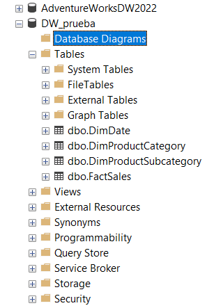

# Proyecto visualizacion de datos con Microoft Adventurework

## Pregunta de inteligencia de negocios

¿Cuál es el rendimiento de ventas por categoría de producto en el último trimestre?

# Creacion de data wherehoue denormalizado

Se generan las tablas de dimension

```sql
CREATE TABLE DimDate (
    DateKey INT PRIMARY KEY,
    Date DATE,
    Day INT,
    Month INT,
    Year INT,
    Quarter INT
);
Código generado por IA. Revisar y usar cuidadosamente. Más información sobre preguntas frecuentes.
Tabla DimProductCategory: En esta tabla almacenaremos las categorías de productos. Aquí está el query:
SQL

CREATE TABLE DimProductCategory (
    ProductCategoryKey INT PRIMARY KEY,
    Name NVARCHAR(50)
);
Código generado por IA. Revisar y usar cuidadosamente. Más información sobre preguntas frecuentes.
Tabla DimProductSubcategory: Esta tabla contendrá las subcategorías de productos. Además, tiene una clave foránea que se relaciona con la tabla DimProductCategory:
SQL

CREATE TABLE DimProductSubcategory (
    ProductSubcategoryKey INT PRIMARY KEY,
    Name NVARCHAR(50),
    ProductCategoryKey INT,
    FOREIGN KEY (ProductCategoryKey) REFERENCES DimProductCategory(ProductCategoryKey)
);
Código generado por IA. Revisar y usar cuidadosamente. Más información sobre preguntas frecuentes.
Tabla FactSales: En esta tabla, registraremos las ventas realizadas, incluyendo detalles como la fecha, el producto vendido y la cantidad. Tiene dos claves foráneas: una para la tabla DimDate y otra para la tabla DimProductSubcategory:
SQL

CREATE TABLE FactSales (
    SalesKey INT PRIMARY KEY,
    OrderDateKey INT,
    ProductKey INT,
    TotalDue DECIMAL(18, 2),
    FOREIGN KEY (OrderDateKey) REFERENCES DimDate(DateKey),
    FOREIGN KEY (ProductKey) REFERENCES DimProductSubcategory(ProductSubcategoryKey)
);
```



Luego se genera el diagrama para visualizar mejor el modelo, en ete caso, se realizó un modelo estrella


# Responder a la pregunta

De esta manera se reponde a la pregunta usando el modelo estrella y viualizando el reporte de las ventas en el ultimo trimestre

```sql
SELECT
    pc.Name AS Categoria,
    SUM(fs.TotalDue) AS VentasTotales
FROM
    FactSales AS fs
    INNER JOIN DimProductSubcategory AS psc ON fs.ProductKey = psc.ProductSubcategoryKey
    INNER JOIN DimProductCategory AS pc ON psc.ProductCategoryKey = pc.ProductCategoryKey
    INNER JOIN DimDate AS d ON fs.OrderDateKey = d.DateKey
WHERE
    d.Quarter = 1 -- Último trimestre
GROUP BY
    pc.Name
ORDER BY
    VentasTotales DESC;
```


**NOTA:** No le generé los datos a cada tabla y por eso no se ve nada