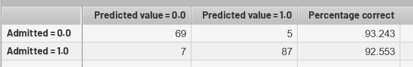
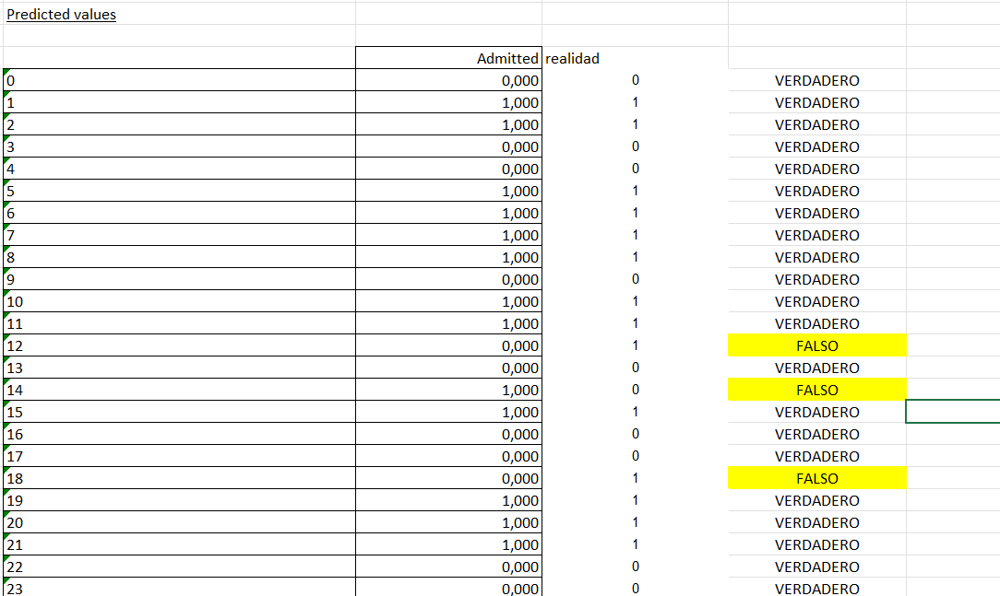

# Apuntes del taller

NOTA: Los analisis y carga de datos se realizaron en la herramienta **PLS**.

Para realizar una regresion logistica se debe de tener en cuenta la matriz de confusion para determinar la acertividad de los resultados.

Por ejemplo, en este caso la matriz nos determino que en total hubo 12 (7+5) resultados los cuales fueron mal predichos. En este caso 5 de los no admitidos fueron predichos como admitidos y 7 de los admitidos fueron predichos como no admitidos. esto quiere decir que **el porcentaje de la potencia de prediccion del modelo es de 92.88%** (esto se obtiene al dividir los valores acertados correctamente 156/168).

Teniendo en cuenta estos datos, requerimos de saber cuales son los valores que no fueron predichos correctamente para saber el popr que esta ocurriendo este succecso, para lograrlo, se descarga el reporte de **regresion logistica** (adjunto documento reg log 1.xlsx donde se muestra los resultados), en el reporte se puestra el apartado de valores predichos, a esto se le compara con los valores reales (los originales de la base de datos) y de esta manera se pueden encontrar los valores.

