# LABORATORIO METERPRETER

Se verifica que si haya conexion con la maquina de windows
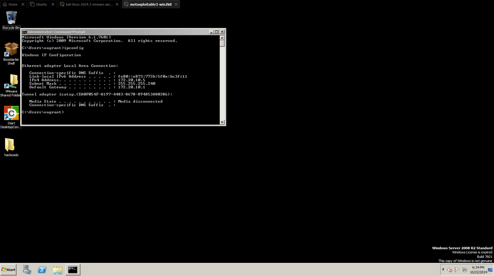
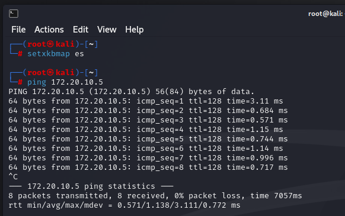

Se inicializa el programa de metasploit (el aplicativo de hacking) para comenzar con el analisis de las vulnerabilidades y caracteristicas del sistema
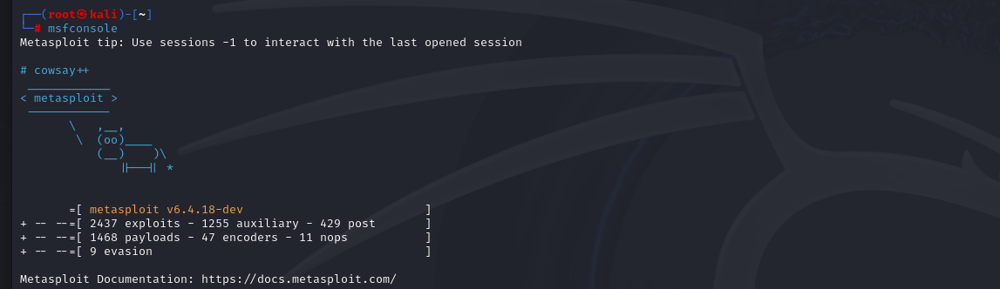

exploit (codigo que se aprovecha de la vulnerabilidad), aca podemos encontrar cual vulneravilidad querermos usar para comenzar el proceso, esta parte es importante ya que si no usamos la vulnerabilidad adecuada no podremos hacer un buen proceso de hacking
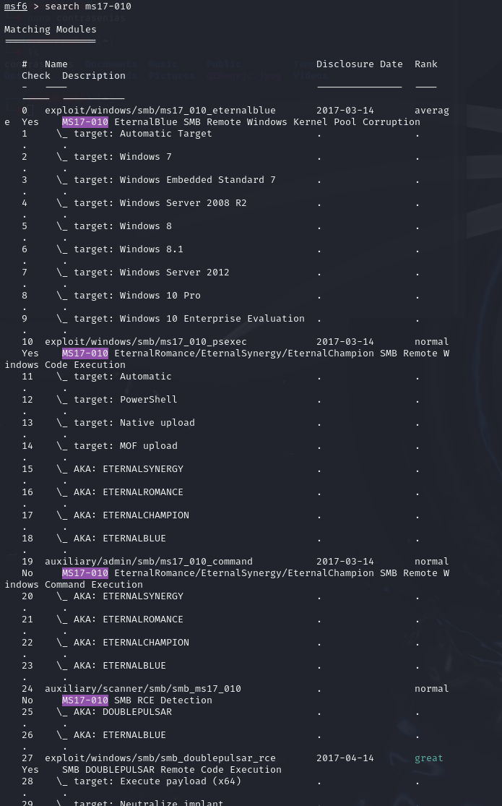

Se configura las opciones que nos pide de la info de windows (sistema atacado)
"use 0" es para usar el proceso que queremos usar, esto lo identificamos anteriormente con el expliot
Y set rshots 172.20.10.5 es para configurar la ip de windows para atacarlo
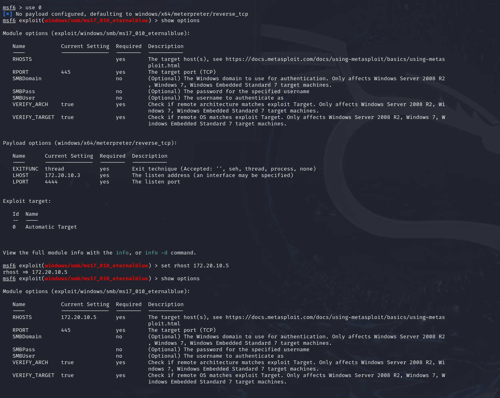

de esta manera podemos ver que fue exitosa la conexion
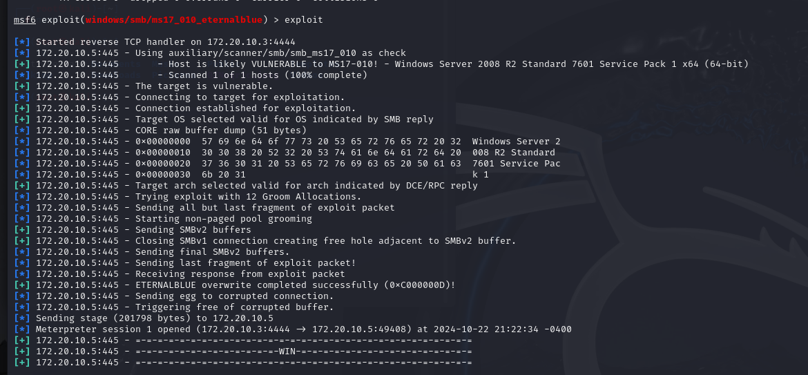

de esta manera conocemos la info del sistema y los procesos que se estan ejecutando, por ejemplo, podemos evidenciar por  el apartando donde dice SYSTEM que tenemos permisos de administrador, en tal caso que diga otra cosa significa que tenemos que hacer un escalado de permisos
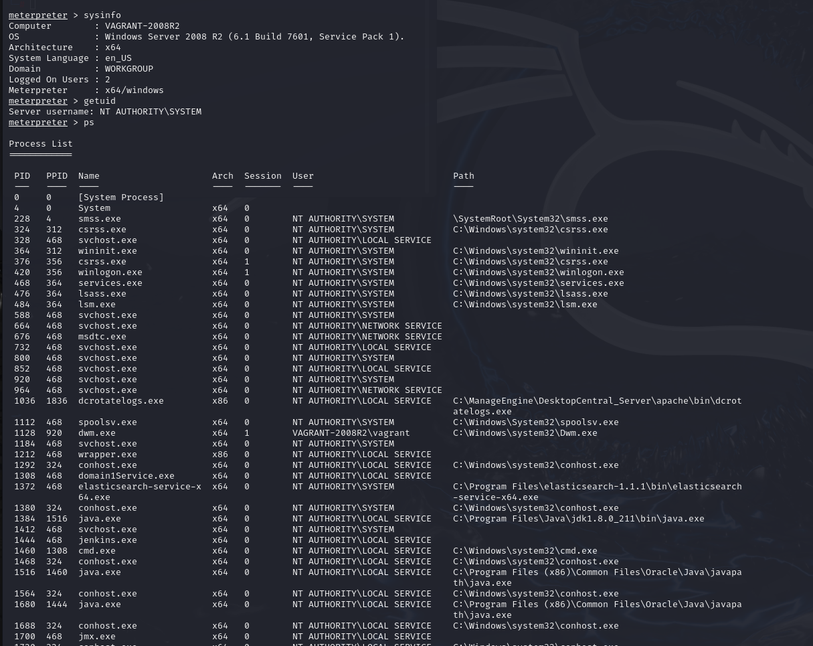

Con este comando podeos ver que esta haciendo el sistema atacado, por ejemplo, ver que esta escribiento en un block de notas, si por ejemplo queremos terminar alguna de las ejecuciones podriamos usar **kill** seguido del numero del proceso para cerrarlo, por ejemplo kill 324

Esto es necesario saberlo ya que de esta manera podriamos matar el proceso del antivirus y para facilitar mas la instalacion de algun programa malicioso

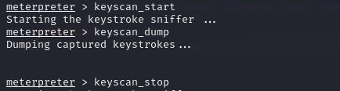

Otra de las funciones que podriamos generar seria la creacion o intalacion de algun archivo o carpeta como en este ejemplo.
De esta misma manera podriamos, por ejemplo, eiminar el system32 y dañar permanentemente el sistema operativo con todos sus archivos
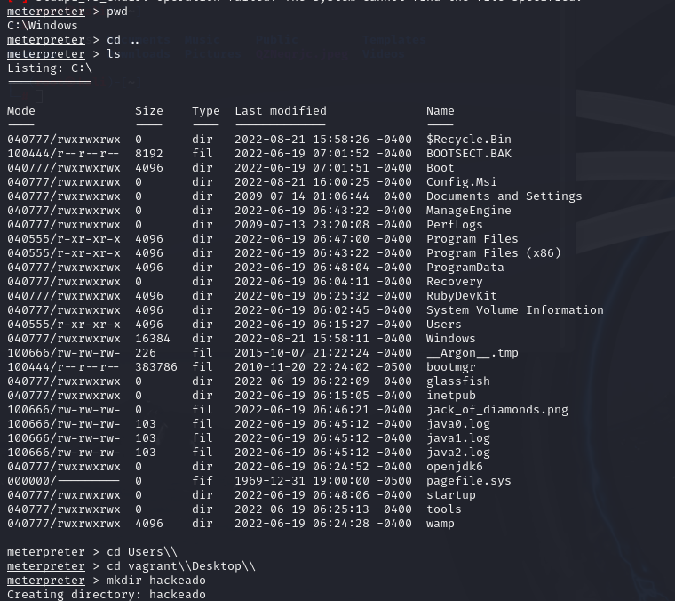
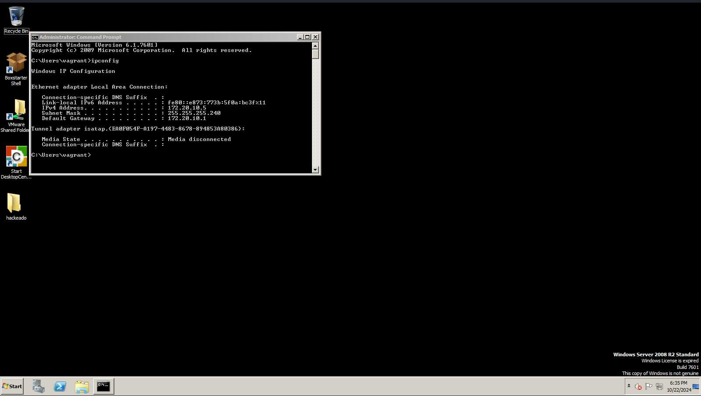

Meterpreter tambien genera herramientas para ver visualmente lo que esta pasando en el sistema atacado con una screenshot (la imagen anterior fue generada con esta funcion)
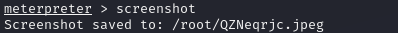

esta la podemos encontrar el la carpeta root 
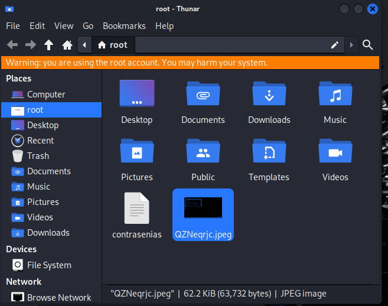

## Conclusion
De esta manera podemos obtener toda la informacion de un sistema que deseemos atarcar, este es el poder de **METERPRETER** siendo una de las herramientas mas usadas que ademas esta instalada de forma predeterminada  en kali linux, con esta herramienta y la ip del sistema podemos crear carpetas, conocer las caracteristicas del sistema, cargar archivos maliciosos, conocer que esta haciendo el usuario casi en tiempo real y hacer todo tipo de daños como dalar el sistema, conocer las contraseñas guardadas y mas.