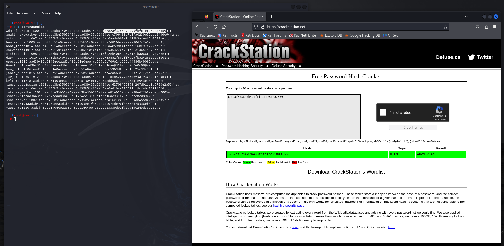

# Archivos hash

Uasndo el comando cat podemos visualizar todo el contenido de este archivo

## Conclusion
Identificando la parte eacta dell archivo podemos identificar la contrassela de la sesion de un sistema operativo, de esta manera podemos ver la importancia de mantener nuestros datos seguros y proteger este tipo de archivos que contienen tanta informacion sensible