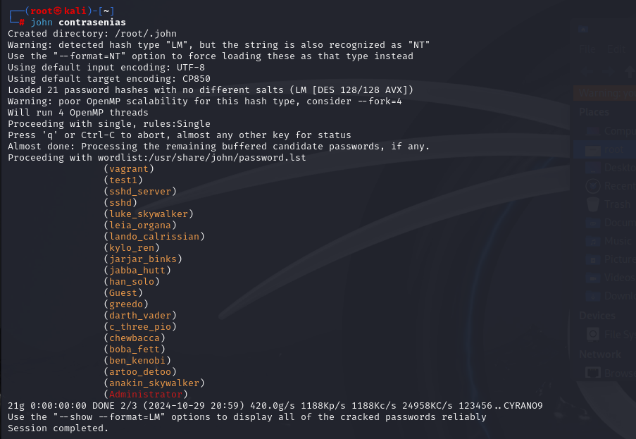

# Explotacion de vulnerabilidades

Usamos la herramienta John the ripper para encontrar la contraseña del arvhivo hash obtenido del laboratorio 11

comenzamos iniciando la herramienta en el archivo

Con este hash usamos la herramienta para encontrar las contraseñas

de esta manera podemos ver que encontro 4 contraseñas en el archivo hash que le pasamos, de las cuales obtuvo facilmente dos de ellas por su baja seguridad en cuanto a la eleccion de caracteres

## Conclusion
Este laboratorio nos sirve para entender por que es tan importante tener una contraseña con combinado de caracteres para mas seguridad, evitando las vulnerabilidades o posibles ataques que podemos llegar a tener, ya que como vimos en el laboratorio, facilmente se encuentra contraseñas que solo estan en minusculas como paso con esos dos uduarios