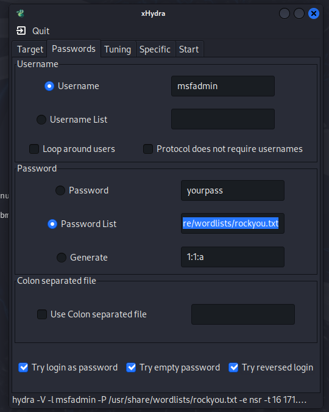

# Obtener la contraseña usando nmap y xhydra

Verificamos nuestra ip y con base a esto, como estamos en el mismo segmento de red, podemos encontrar la ip de la maquina que atacaremos, en este caso es el tercero

Verificamos toda la informacion sobre la quina a atacar

para encontras la contraseña del usuario ejecutamos la herramienta xhydra y realizamos la respectivas configuraciones segun la ip y protocolo que usaremos

se configura la contraseña segun el documento de rockyou donde hay una lista de posibles contraseñas y se especifica el usuario que atacaremos

ejecutamos la herramienta para que cominece a encontrar la contraseña

De esta manera econtramos el usuario y contraseña de msfadmin y pudimos ingresar a la maquina

## Concluison
El uso de una contraseña lo suficientemente compleja es una necesidad al momento de querer proteger nuestros datos ya que con este laboratorio queda demostrado que decifrar la contrasseña es un proceso que puede llegar a ser muy sencillo si los caracteres en la contraseña no son los adecuados.