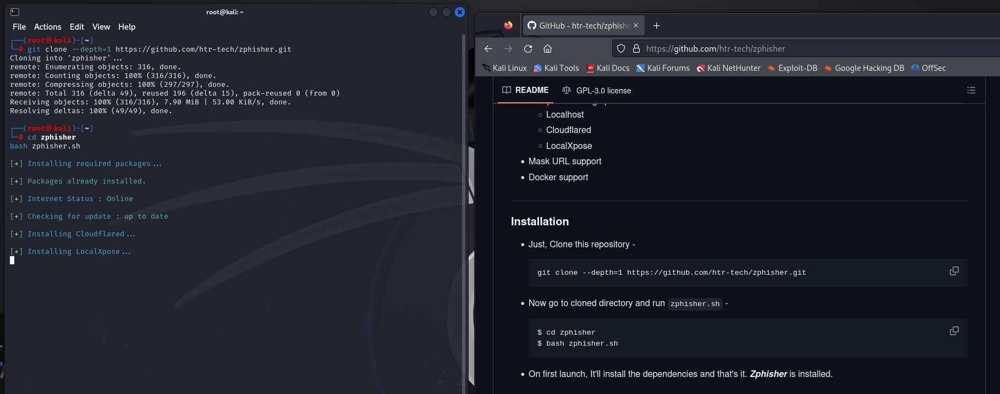

# Herramienta phishing
instalamos e iniciamos la herramienta por medio del repositorio de github

ya en la herramineta escojemos la opcion que deseamos clonar 

Se ejecutaran una serie de permmisos y herramientas

De esta manera querada creada una copia identica de la pagina deseada para poder obtener la informacion de usuario y contraseña que se digite en esta usando el link obtenido

## Conlcusion
De esta manera podemos ver como es de sencillo consegir los usuarios de cualquier persona que por miedo o codicia entre a un link desconocido o sospechoso, este es un claro ejemplo de que tenemos que tener cuidado con las cosas a las que hacemos click porque podemos poner en riesgo nuestros propios datos o los de la empresa en la que trabajamos.