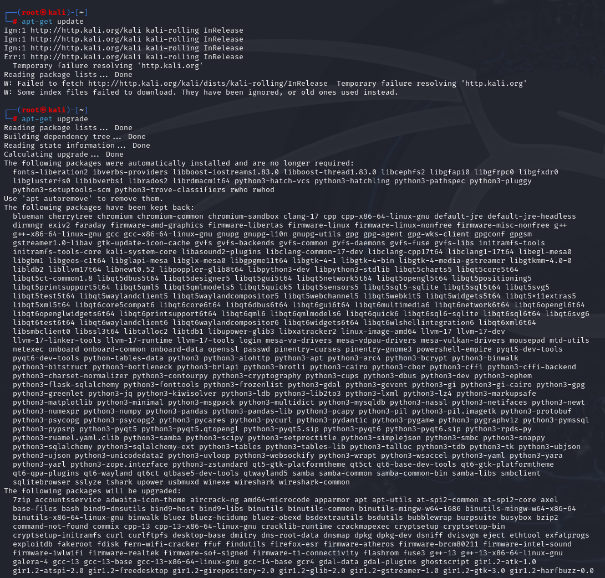
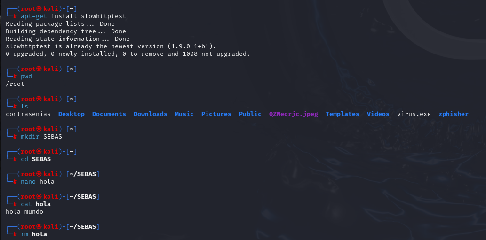
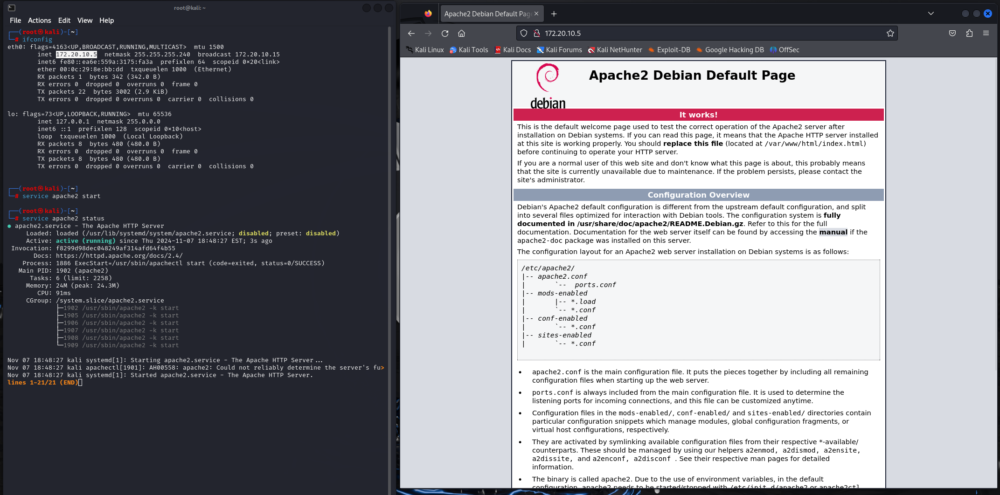

# Introduccion a maquina vistual

Comenzamo actialuxando la maquina para no tener problemas con la intalacion de algun  programa 

Procedemos a ralizar comandos basico spara adaptarons a la consola, esto comandos son:
* apt-get : con el cual podemos realizar instalaciones y actallizaciones
* mkdir : Creacion de carpetas
* cd : Navegar entre directorios
* nano : Crear un archivo texto
* cat : visualizar el contenido de un archivo
* rm para eliminar un archivo

Con el comando **ifconfig** podemos ver lo detalles de netra red para proceder a uarlo para visualizar el servicio de host apache

# Conclusion
Es importante conocer la forma en la cual funciona liniux ya que la fomr ama eficiente de uasr el mismo es por medio de la termial, ademas entender como funcionar servicios para realizar servicio web de forma local como apache