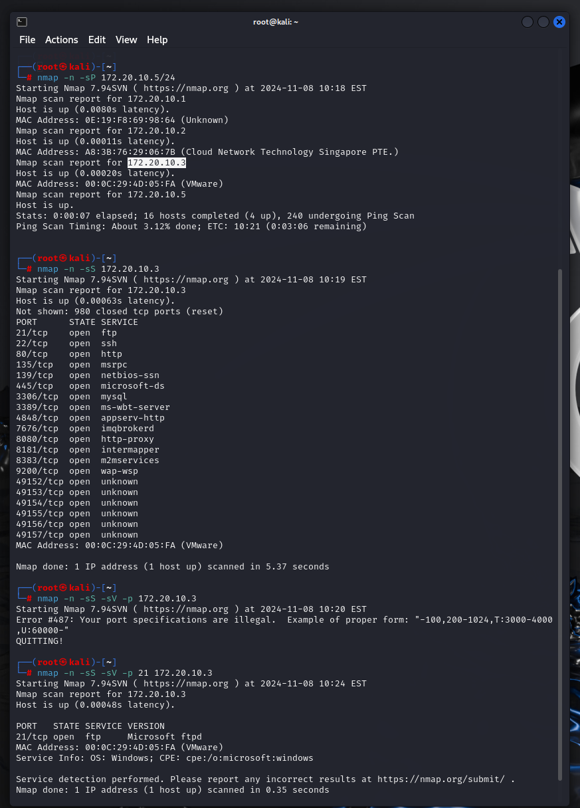
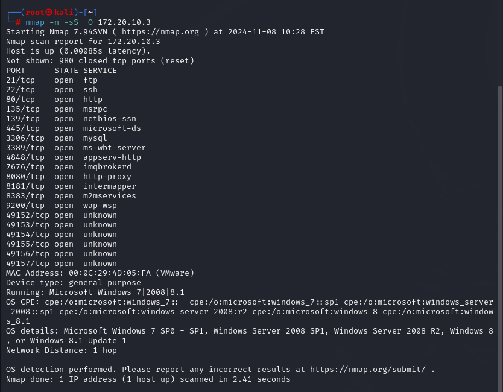

# NMAP

Comenzamos buscando la ip de nuestra maquina a atacar uando nuestra propia ip y la mascara para saver quien mas eta conectado a la mima red y obtener la ip

Procedemos a bucar toda la imnformacion de la maquina usando la ip que encontramos

Y de esta manera ya podemos tener toda la informacion de la maquina atacada como su sistema operativo

## Conclusion
Tenemos que tener cuidado con las redes de internet a lass cuales nos conctamos, como, por ejemplo, las rede publicas, ya que en este momento podemos ver como se puede llegar a obtener toda la informacion de nuestra maquina y mas para poder perjudicar nuestra seguridad.