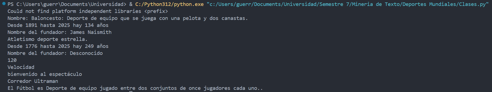
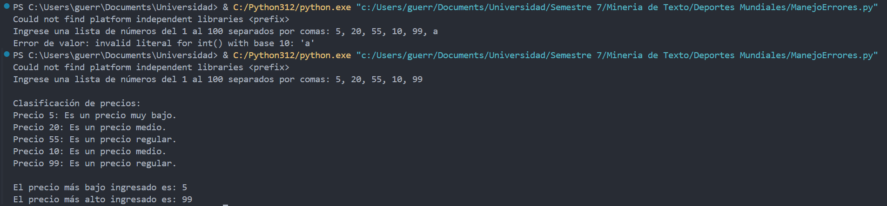
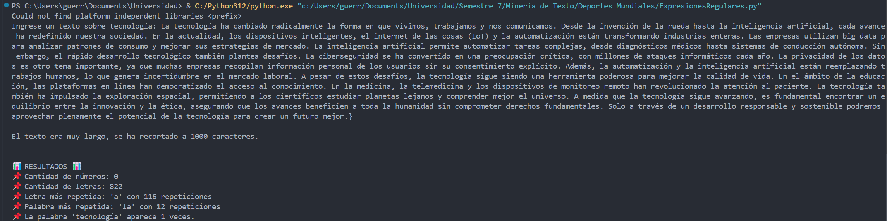

# Taller 01

**Docente:** Daniel Alejandro Lopez  
**Materia:** Minería de Texto  

## Realice la codificación en Python  

### Pregunta P.O.O  

#### Creación de la carpeta y clases  

Crear una carpeta llamada **Deportes Mundiales**. Dentro de esta carpeta, se deben crear las siguientes clases:  

#### Clase **Deportes**  

La clase **Deportes** tendrá los siguientes atributos protegidos:  
- `Nombre`  
- `Descripción`  
- `Año de fundación en Colombia`  
- `Nombre del fundador`  

##### Métodos:  
1. **`ConsultarDescripcionDeporte()`**  
   - Retorna el nombre y la descripción del deporte.  

2. **`ConsultarAñoFundacion()`**  
   - Recibe el atributo `Año de fundación` y regresa la cantidad de años desde su fundación hasta la fecha actual.  

3. **`ConsultarFundador()`**  
   - Recibe el nombre del fundador y lo retorna.  

---

#### Clases **Atletismo** y **Fútbol**  

Las clases **Atletismo** y **Fútbol** heredan de **Deportes**.  

##### **Clase Atletismo**  
- Atributos heredados: `Nombre`, `Descripción`, `Año de fundación`.  
- Atributo adicional: `Número de personas que pueden correr` (determinar el nivel de acceso adecuado).  

##### Métodos de la clase **Atletismo**:  
1. **`ConsultarDescripcionDeporte()`**  
   - Sobreescribe el método de la clase padre y retorna:  
     > "Atletismo, deporte estrella."  

2. **`ConsultarAñoFundacion()`**  
   - Funciona igual que el método de la clase **Deportes**.  

3. **`ConsultarFundador()`**  
   - Funciona igual que el método de la clase **Deportes**.  

4. **`ConsultaCarrerasAno(año)`**  
   - Retorna la cantidad de carreras realizadas según el año:  
     - 2020 → 70 carreras  
     - 2021 → 120 carreras  
     - 2022 → 245 carreras  

5. **`ConsultarTiposAtletismo(opcion)`**  
   - Retorna el tipo de atletismo según el número ingresado:  
     - `1 → Fondo`  
     - `2 → Marcha`  
     - `3 → Velocidad`  
     - `4 → Senderismo`  

6. **`ConsultarEstadio(cantidad_espectadores)`**  
   - Valida la cantidad de espectadores y retorna un mensaje:  
     - `0 a 50` → "No se puede implementar deportes con esa cantidad de espectadores."  
     - `51 a 101` → "Bienvenido al espectáculo."  

7. **`ConsultarTiposCorredores(kilometros)`**  
   - Retorna el tipo de corredor según la distancia:  
     - `8K → Corredor amateur`  
     - `16K → Corredor Senior`  
     - `24K → Corredor Maratonista`  
     - `42K → Corredor Ultraman`  

---

### Pregunta sobre Listas y Diccionarios  

Hacerlo con manejo de errores.  

- Escribir un programa que almacene en una lista los siguientes precios (números del 1 al 100).  
- Clasificar los precios de la siguiente manera:  
  - **Menor que 10** → "Es un precio muy bajo."  
  - **Entre 10 y 50** → "Es un precio medio."  
  - **Mayor que 50** → "El precio es regular."  
- Los números deben ser ingresados por el usuario.  
- Al final, mostrar el precio menor y el precio mayor.  

---

### Pregunta sobre Expresiones Regulares  

1. Pedir al usuario la introducción de un texto de un libro de tecnología.  
2. Validar que no tenga más de **1000 caracteres** (si es mayor, recortar a 1000 caracteres).  
3. Contar la cantidad de **números** que contiene el texto.  
4. Contar la cantidad de **letras**.  
5. Identificar **la letra y la palabra que más se repiten**.  
6. Contar cuántas veces aparece la palabra **"tecnología"**.  
7. Utilizar **mínimo una expresión regular** para la búsqueda de texto.  

