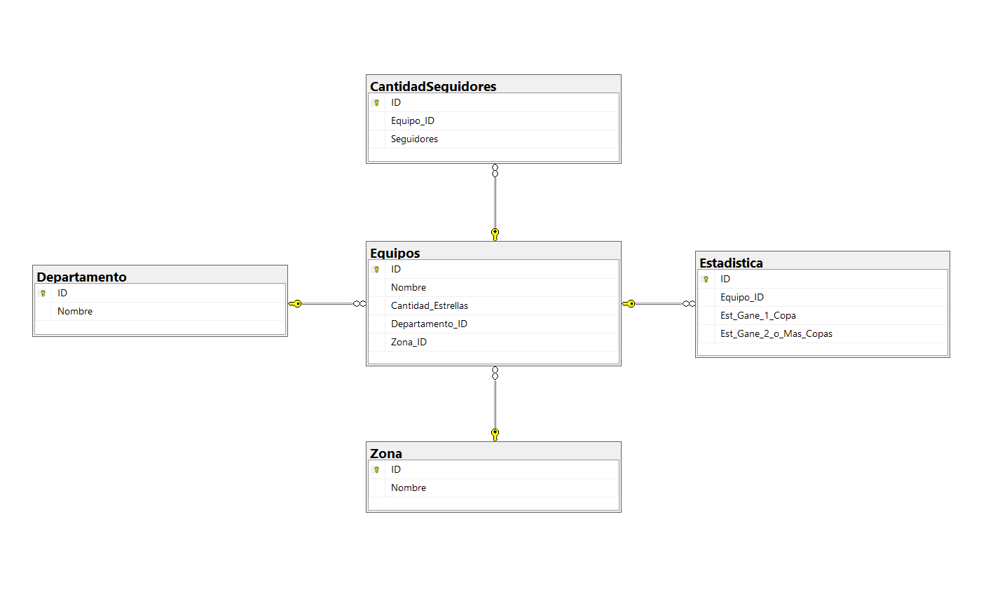

# Solución del taller

## Taller
Docente: Daniel Lopez.  
Herramienta: EXCEL, MYSQL y SQL SERVER.  
Pasos:
1. Crear las tablas, Modelamiento en SQL SERVER y MYSQL.
2. Llenar tablas en las bases de datos.
3. Hacer consultas en Excel.
4. Hacer consultas en SQL SERVER y MYSQL.

### Equipos

| ID | Nombre | Cantidad estrellas | Departamento FK | Zonas FK |
|----|--------|--------------------|-----------------|----------|
| 1  | ATLETICO NACIONAL S.A | 10 | 1 | 1 |
| 2  | EL EQUIPO DEL PUEBLO S.A. (Medellín) | 1 | 1 | 1 |
| 3  | CLUB DEPORTIVO POPULAR JUNIOR FC S.A. | 10 | 2 | 2 |
| 4  | ASOCIACION DEPORTIVO CALI | 17 | 3 | 3 |
| 5  | AMERICA DE CALI S.A | 5 | 3 | 3 |
| 6  | AZUL & BLANCO MILLONARIOS FC SA. | 20 | 4 | 4 |
| 7  | ONCE CALDAS S.A. | 8 | 5 | 5 |
| 8  | ENVIGADO FUTBOL CLUB S.A. | 6 | 1 | 1 |
| 9  | CUCUTA DEPORTIVO F.C S.A. EN REORGANIZACIÓN | 12 | 6 | 6 |
| 10 | CORPORACION SOCIAL DEPORTIVA Y CULTURAL DE PEREIRA CORPEREIRA | 19 | 7 | 5 |
| 11 | INDEPENDIENTE SANTA FE S.A. | 16 | 4 | 4 |
| 12 | CLUB DEPORTES TOLIMA S. A. | 14 | 8 | 7 |
| 13 | CLUB DEPORTIVO LA EQUIDAD | 15 | 4 | 4 |
| 14 | Real Cartagena Fútbol Club S.A. | 3 | 9 | 2 |
| 15 | PATRIOTAS BOYACÁ S.A. | 20 | 10 | 4 |
| 16 | DEPORTES QUINDIO S.A. | 5 | 11 | 5 |
| 17 | CORPORACION CLUB DEPORTIVO TULUA | 4 | 3 | 3 |
| 18 | CLUB DEPORTIVO ATLETICO HUILA S.A. | 18 | 12 | 6 |
| 19 | CLUB LLANEROS S.A | 13 | 13 | 7 |
| 20 | JAGUARES FUTBOL CLUB S.A. | 4 | 14 | 7 |
| 21 | TALENTO DORADO S.A | 9 | 1 | 1 |
| 22 | ALIANZA PETROLERA FC. S.A. | 16 | 15 | 7 |
| 23 | LEONES FC S.A. | 3 | 1 | 1 |
| 24 | FORTALEZA FÚTBOL CLUB S.A. | 19 | 10 | 1 |
| 25 | CLUB ATLETICO BUCARAMANGA SA | 19 | 16 | 6 |
| 26 | UNION MAGDALENA S.A. | 19 | 17 | 2 |
| 27 | DEPORTIVO BOYACÁ CHICÓ F.C S.A. | 14 | 10 | 4 |
| 28 | BOGOTA FUTBOL CLUB S.A. | 9 | 4 | 4 |
| 29 | CLUB DEPORTIVO REAL SANTANDER S.A. | 14 | 16 | 6 |
| 30 | BARRANQUILLA FUTBOL CLUB S.A. | 19 | 2 | 2 |
| 31 | ORSOMARSO SC S.A | 3 | 4 | 4 |
| 32 | CLUB DEPORTIVO ATLETICO FUTBOL S.A | 10 | 1 | 1 |
| 33 | VALLEDUPAR FUTBOL CLUB SA | 13 | 18 | 2 |
| 34 | UNIVERSITARIO POPAYÁN S.A. | 12 | 19 | 1 |
| 35 | TIGRES FUTBOL CLUB S.A. | 17 | 1 | 3 |

### Zona

| ID | Nombre |
|----|--------|
| 1  | Zona A |
| 2  | Zona B |
| 3  | Zona C |
| 4  | Zona D |
| 5  | Zona E |
| 6  | Zona F |
| 7  | Zona G |
| 8  | Zona H |

### Departamento

| ID | Nombre |
|----|--------|
| 1  | Antioquia |
| 2  | Barranquilla |
| 3  | Valle del Cauca |
| 4  | Cundinamarca |
| 5  | Caldas |
| 6  | Santander |
| 7  | Risaralda |
| 8  | Tolima |
| 9  | Cartagena |
| 10 | Boyaca |
| 11 | Amazonas |
| 12 | Huila |
| 13 | Llanos |
| 14 | San Andres |
| 15 | Llanos |
| 16 | Santander |
| 17 | Magdalena |
| 18 | Valledupar |
| 19 | Popayan |

### Cantidad de seguidores

| ID  | Equipo | # Seguidores |
|-----|--------|--------------|
| 1-S | 1      | 6491         |
| 2-S | 2      | 17824        |
| 3-S | 3      | 5624         |
| 1-S | 4      | 25500        |
| 2-S | 5      | 25148        |
| 3-S | 6      | 28910        |
| 1-S | 7      | 25511        |
| 2-S | 8      | 11707        |
| 3-S | 9      | 25315        |
| 1-S | 10     | 5800         |
| 2-S | 11     | 2195         |
| 3-S | 12     | 28189        |
| 1-S | 13     | 22789        |
| 2-S | 14     | 8493         |
| 3-S | 15     | 12378        |
| 1-S | 16     | 12542        |
| 2-S | 17     | 15209        |
| 3-S | 18     | 13832        |
| 1-S | 19     | 7376         |

### Estadística

| ID  | Equipo | Estadística Gane 1 Copa | Estadística gane 2 o más Copas |
|-----|--------|-------------------------|--------------------------------|
| 1   | 1      | 74                      | 24                             |
| 2   | 2      | 48                      | 10                             |
| 3   | 3      | 25                      | 22                             |
| 6   | 4      | 74                      | 34                             |
| 9   | 5      | 50                      | 45                             |
| 10  | 6      | 47                      | 96                             |
| 11  | 7      | 50                      | 99                             |
| 4   | 8      | 29                      | 72                             |
| 5   | 9      | 75                      | 3                              |
| 13  | 10     | 16                      | 62                             |
| 7   | 11     | 17                      | 14                             |
| 8   | 12     | 29                      | 65                             |
| 12  | 13     | 45                      | 74                             |
| 13  | 14     | 35                      | 14                             |
| 14  | 15     | 34                      | 81                             |
| 15  | 16     | 83                      | 86                             |
| 16  | 17     | 93                      | 91                             |
| 17  | 18     | 29                      | 57                             |
| 18  | 19     | 45                      | 61                             |

### SQL Scripts

```sql
-- Crear la tabla Zona
CREATE TABLE Zona (
    ID INT PRIMARY KEY, -- No autoincremental
    Nombre VARCHAR(50) NOT NULL
);

-- Insertar los datos
INSERT INTO Zona (ID, Nombre) VALUES
(1, 'Zona A'),
(2, 'Zona B'),
(3, 'Zona C'),
(4, 'Zona D'),
(5, 'Zona E'),
(6, 'Zona F'),
(7, 'Zona G'),
(8, 'Zona H');

-- Verificar los datos
SELECT * FROM Zona;

-- Crear la tabla Departamento
CREATE TABLE Departamento (
    ID INT PRIMARY KEY IDENTITY(1,1),
    Nombre VARCHAR(50) NOT NULL
);

-- Insertar los datos
INSERT INTO Departamento (Nombre) VALUES
('Antioquia'),
('Barranquilla'),
('Valle del Cauca'),
('Cundinamarca'),
('Caldas'),
('Santander'),
('Risaralda'),
('Tolima'),
('Cartagena'),
('Boyaca'),
('Amazonas'),
('Huila'),
('Llanos'),
('San Andres'),
('Llanos'),
('Santander'),
('Magdalena'),
('Valledupar'),
('Popayan');

-- Verificar los datos
SELECT * FROM Departamento;

-- Crear la tabla Equipos
CREATE TABLE Equipos (
    ID INT PRIMARY KEY IDENTITY(1,1),
    Nombre VARCHAR(100) NOT NULL,
    Cantidad_Estrellas INT NOT NULL,
    Departamento_ID INT,
    Zona_ID INT,
    FOREIGN KEY (Departamento_ID) REFERENCES Departamento(ID),
    FOREIGN KEY (Zona_ID) REFERENCES Zona(ID)
);

-- Insertar los datos
INSERT INTO Equipos (Nombre, Cantidad_Estrellas, Departamento_ID, Zona_ID) VALUES
('ATLETICO NACIONAL S.A', 10, 1, 1),
('EL EQUIPO DEL PUEBLO S.A. (Medellín)', 1, 1, 1),
('CLUB DEPORTIVO POPULAR JUNIOR FC S.A.', 10, 2,
('ONCE CALDAS S.A.', 8, 5, 5),
('ENVIGADO FUTBOL CLUB S.A.', 6, 1, 1),
('CUCUTA DEPORTIVO F.C S.A. EN REORGANIZACIÓN', 12, 6, 6),
('CORPORACION SOCIAL DEPORTIVA Y CULTURAL DE PEREIRA CORPEREIRA', 19, 7, 5),
('INDEPENDIENTE SANTA FE S.A.', 16, 4, 4),
('CLUB DEPORTES TOLIMA S. A.', 14, 8, 7),
('CLUB DEPORTIVO LA EQUIDAD', 15, 4, 4),
('Real Cartagena Fútbol Club S.A.', 3, 9, 2),
('PATRIOTAS BOYACÁ S.A.', 20, 10, 4),
('DEPORTES QUINDIO S.A.', 5, 11, 5),
('CORPORACION CLUB DEPORTIVO TULUA', 4, 3, 3),
('CLUB DEPORTIVO ATLETICO HUILA S.A.', 18, 12, 6),
('CLUB LLANEROS S.A', 13, 13, 7),
('JAGUARES FUTBOL CLUB S.A.', 4, 14, 7),
('TALENTO DORADO S.A', 9, 1, 1),
('ALIANZA PETROLERA FC. S.A.', 16, 15, 7),
('LEONES FC S.A.', 3, 1, 1),
('FORTALEZA FÚTBOL CLUB S.A.', 19, 10, 1),
('CLUB ATLETICO BUCARAMANGA SA', 19, 16, 6),
('UNION MAGDALENA S.A.', 19, 17, 2),
('DEPORTIVO BOYACÁ CHICÓ F.C S.A.', 14, 10, 4),
('BOGOTA FUTBOL CLUB S.A.', 9, 4, 4),
('CLUB DEPORTIVO REAL SANTANDER S.A.', 14, 16, 6),
('BARRANQUILLA FUTBOL CLUB S.A.', 19, 2, 2),
('ORSOMARSO SC S.A', 3, 4, 4),
('CLUB DEPORTIVO ATLETICO FUTBOL S.A', 10, 1, 1),
('VALLEDUPAR FUTBOL CLUB SA', 13, 18, 2),
('UNIVERSITARIO POPAYÁN S.A.', 12, 19, 1),
('TIGRES FUTBOL CLUB S.A.', 17, 1, 3);

-- Verificar los datos
SELECT * FROM Equipos;

-- Crear la tabla CantidadSeguidores
CREATE TABLE CantidadSeguidores (
    ID INT PRIMARY KEY IDENTITY(1,1),
    Equipo_ID INT,
    Seguidores INT,
    FOREIGN KEY (Equipo_ID) REFERENCES Equipos(ID)
);

-- Insertar los datos
INSERT INTO CantidadSeguidores (Equipo_ID, Seguidores) VALUES
(1, 6491),
(2, 17824),
(3, 5624),
(4, 25500),
(5, 25148),
(6, 28910),
(7, 25511),
(8, 11707),
(9, 25315),
(10, 5800),
(11, 2195),
(12, 28189),
(13, 22789),
(14, 8493),
(15, 12378),
(16, 12542),
(17, 15209),
(18, 13832),
(19, 7376);

-- Verificar los datos
SELECT * FROM CantidadSeguidores;

-- Crear la tabla Estadistica
CREATE TABLE Estadistica (
    ID INT PRIMARY KEY, -- No autoincremental
    Equipo_ID INT,
    Est_Gane_1_Copa INT,
    Est_Gane_2_o_Mas_Copas INT,
    FOREIGN KEY (Equipo_ID) REFERENCES Equipos(ID)
);

-- Insertar los datos
INSERT INTO Estadistica (ID, Equipo_ID, Est_Gane_1_Copa, Est_Gane_2_o_Mas_Copas) VALUES
(1, 1, 74, 24),
(2, 2, 48, 10),
(3, 3, 25, 22),
(6, 4, 74, 34),
(9, 5, 50, 45),
(10, 6, 47, 96),
(11, 7, 50, 99),
(4, 8, 29, 72),
(5, 9, 75, 3),
(13, 10, 16, 62),
(7, 11, 17, 14),
(8, 12, 29, 65),
(12, 13, 45, 74),
(14, 14, 35, 14),
(15, 15, 34, 81),
(16, 16, 83, 86),
(17, 17, 93, 91),
(18, 18, 29, 57),
(19, 19, 45, 61);

-- Verificar los datos
SELECT * FROM Estadistica;

## Diagrama




## Consultas

1. Consultas
• Listado de cantidad equipos por Ciudad.
SELECT D.Nombre AS Departamento, COUNT(E.ID) AS Cantidad_Equipos
FROM Departamento D
JOIN Equipos E ON D.ID = E.Departamento_ID
GROUP BY D.Nombre;

• Listado de cantidad de equipos por Zona.
SELECT Z.Nombre AS Zona, COUNT(E.ID) AS Cantidad_Equipos
FROM Zona Z
JOIN Equipos E ON Z.ID = E.Zona_ID
GROUP BY Z.Nombre;

• Ciudad con mayores equipos.
SELECT TOP 1 D.Nombre AS Ciudad, COUNT(E.ID) AS Cantidad_Equipos
FROM Departamento D
JOIN Equipos E ON D.ID = E.Departamento_ID
GROUP BY D.Nombre
ORDER BY Cantidad_Equipos DESC;

• Ciudad con menos equipos.
SELECT TOP 1 D.Nombre AS Ciudad, COUNT(E.ID) AS Cantidad_Equipos
FROM Departamento D
JOIN Equipos E ON D.ID = E.Departamento_ID
GROUP BY D.Nombre
ORDER BY Cantidad_Equipos ASC;

• Equipo con mayores estrellas.
SELECT TOP 1 E.Nombre AS Equipo, E.Cantidad_Estrellas
FROM Equipos E
ORDER BY E.Cantidad_Estrellas DESC;

• Promedio de estrellas de los equipos de las zonas.
SELECT Z.Nombre AS Zona, AVG(E.Cantidad_Estrellas) AS Promedio_Estrellas
FROM Zona Z
JOIN Equipos E ON Z.ID = E.Zona_ID
GROUP BY Z.Nombre;

• Cantidad de seguidores por zonas.
SELECT Z.Nombre AS Zona, SUM(C.Seguidores) AS Cantidad_Seguidores
FROM Zona Z
JOIN Equipos E ON Z.ID = E.Zona_ID
JOIN CantidadSeguidores C ON E.ID = C.Equipo_ID
GROUP BY Z.Nombre;

• Si la cantidad de seguidores de una zona es mayor a 10000, debe decir es equipo grande, de lo contrario debe decir equipos pequeños.
SELECT Z.Nombre AS Zona, 
       CASE 
           WHEN SUM(C.Seguidores) > 10000 THEN 'Equipo Grande'
           ELSE 'Equipo Pequeño'
       END AS Tipo_Equipo
FROM Zona Z
JOIN Equipos E ON Z.ID = E.Zona_ID
JOIN CantidadSeguidores C ON E.ID = C.Equipo_ID
GROUP BY Z.Nombre;

• Cuál es el que más tiene % de probabilidad de ganar una Copa.
SELECT TOP 1 E.Nombre AS Equipo, Es.Est_Gane_1_Copa
FROM Equipos E
JOIN Estadistica Es ON E.ID = Es.Equipo_ID
ORDER BY Es.Est_Gane_1_Copa DESC;

• Cuál es el que tiene mayor probabilidad de ganar 2 copas.
SELECT TOP 1 E.Nombre AS Equipo, Es.Est_Gane_2_o_Mas_Copas
FROM Equipos E
JOIN Estadistica Es ON E.ID = Es.Equipo_ID
ORDER BY Es.Est_Gane_2_o_Mas_Copas DESC;

• Ordenar las zonas de mayor a menor las que mas tiene probabilidad de ganar más de dos copas.
SELECT Z.Nombre AS Zona, SUM(Es.Est_Gane_2_o_Mas_Copas) AS Probabilidad_Total
FROM Zona Z
JOIN Equipos E ON Z.ID = E.Zona_ID
JOIN Estadistica Es ON E.ID = Es.Equipo_ID
GROUP BY Z.Nombre
ORDER BY Probabilidad_Total DESC;

• Si el equipo es Equipo Grande y tiene mayor % probabilidad de ganar una copa entonces decir “Futuro Campeón.”
SELECT E.Nombre AS Equipo, Z.Nombre AS Zona, C.Seguidores, Es.Est_Gane_1_Copa,
       CASE
           WHEN C.Seguidores > 10000 AND Es.Est_Gane_1_Copa = (SELECT MAX(Es2.Est_Gane_1_Copa) FROM Estadistica Es2) THEN 'Futuro Campeón'
           ELSE 'No Futuro Campeón'
       END AS Futuro_Campeon
FROM Equipos E
JOIN Zona Z ON E.Zona_ID = Z.ID
JOIN CantidadSeguidores C ON E.ID = C.Equipo_ID
JOIN Estadistica Es ON E.ID = Es.Equipo_ID;