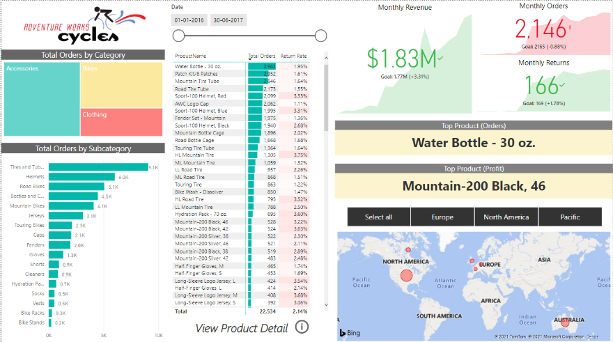

Docente: Daniel Lopez

## Herramientas
- SQL Server
- Power BI

## Pasos

1. Tomar la base de datos de AdventureWorks e importarla a SQL Server.
2. Buscar el diccionario de datos y el esquema relacionado con Producción y Talento Humano.
3. Generar conclusiones basadas en datos.

[AdventureWorks Data Dictionary](https://dataedo.com/download/AdventureWorks.pdf)

## Consultas SQL

1. Mostrar el monto total de ventas por producto (nombre del producto). Mostrar el nombre del producto que más se vendió.

SELECT TOP 1 p.Name AS Producto, SUM(sod.LineTotal) AS MontoTotalVentas
FROM Sales.SalesOrderDetail sod
JOIN Production.Product p ON sod.ProductID = p.ProductID
GROUP BY p.Name
ORDER BY MontoTotalVentas DESC;

2. Mostrar el nombre del producto cuyas ventas fueron mayores.

SELECT TOP 1 p.Name AS Producto, SUM(sod.OrderQty) AS CantidadVendida
FROM Sales.SalesOrderDetail sod
JOIN Production.Product p ON sod.ProductID = p.ProductID
GROUP BY p.Name
ORDER BY CantidadVendida DESC;

3. Nombre y precio de los productos que no se repitan cuyo ID sea menor de 777.

SELECT DISTINCT Name, ListPrice
FROM Production.Product
WHERE ProductID < 777;

4. Con las tablas `SalesOrderHeader`, `Product`, `SalesPerson`, `Customer`: Consultar nombre del cliente, del empleado y del producto de las órdenes con precio entre 10 y 30.

SELECT DISTINCT 
    G.FirstName + ' ' + G.LastName AS NOMBRE, 
    I.FirstName + ' ' + I.LastName AS EMPLEADO 
FROM SALES.SalesOrderHeader AS A
INNER JOIN SALES.Customer AS B ON A.CustomerID = B.CustomerID
INNER JOIN SALES.SalesPerson AS C ON A.SalesPersonID = C.BusinessEntityID
INNER JOIN SALES.SalesOrderDetail AS D ON A.SalesOrderID = D.SalesOrderID
INNER JOIN SALES.SpecialOfferProduct AS E ON E.SpecialOfferID = D.SalesOrderDetailID
INNER JOIN Production.Product AS F ON F.ProductID = E.ProductID
INNER JOIN Person.Person AS G ON G.BusinessEntityID = B.PersonID
INNER JOIN HumanResources.Employee AS H ON H.BusinessEntityID = C.BusinessEntityID
INNER JOIN Person.Person AS I ON I.BusinessEntityID = H.BusinessEntityID
WHERE D.UnitPrice BETWEEN 10 AND 30;

5. Con las tablas `SalesOrderHeader`, `SalesTerritory`: País a donde fueron las ventas más altas.

SELECT TOP 1 st.Name AS Pais, SUM(soh.TotalDue) AS TotalVentas
FROM Sales.SalesOrderHeader soh
JOIN Sales.SalesTerritory st ON soh.TerritoryID = st.TerritoryID
GROUP BY st.Name
ORDER BY TotalVentas DESC;

6. Ventas por territorio para todas las filas de `SalesOrderHeader`: Traer sólo los territorios que se pasen de $10 millones en ventas históricas, traer el total de las ventas y el `TerritoryID`.

SELECT st.TerritoryID, st.Name AS Territorio, SUM(soh.TotalDue) AS TotalVentas
FROM Sales.SalesOrderHeader soh
JOIN Sales.SalesTerritory st ON soh.TerritoryID = st.TerritoryID
GROUP BY st.TerritoryID, st.Name
HAVING SUM(soh.TotalDue) > 10000000;

7. Usando `Production.Product`: Si el valor en color no es NULL devolver “Sin color”. Si el color sí está, devolver el color.

SELECT Name, 
       ISNULL(Color, 'Sin color') AS Color
FROM Production.Product;

## Tablero en Power BI

Haga el siguiente tablero en Power BI con los datos de AdventureWorks (lo más parecido posible).

